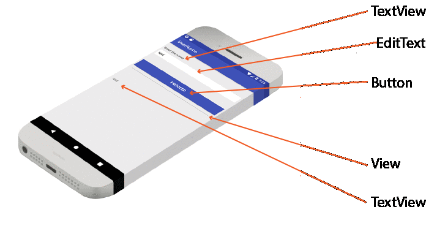

Creating an application for getting user inputs and displaying a list of all insertions in a textView. Each name should be entered individually, and a button should be pressed to validate the input.



First, Create a new android project. When you start a new project, Android Studio creates the necessary structure for all your files and makes them visible in the Project window on the left side of the IDE. Listed below are the files I have right after creating a new project in Android Studio. Android Studio displays your project files in the Android view. This view does not reflect the actual file hierarchy on disk, but is organized by modules and file types to simplify navigation between key source files of your project, hiding certain files or directories that are not commonly used. 


There are three main files we are going to edit, and they are: 
- manifest.xml, 
- MainActivity.java
- activity_main.xml

#### manifest.xml

```xml
<?xml version="1.0" encoding="utf-8"?>
<manifest xmlns:android="http://schemas.android.com/apk/res/android"
    package="mg.studio.username">

    <application
        android:allowBackup="true"
        android:icon="@mipmap/ic_launcher"
        android:label="@string/app_name"
        android:roundIcon="@mipmap/ic_launcher_round"
        android:supportsRtl="true"
        android:theme="@style/AppTheme">
        <activity android:name=".MainActivity">
            <intent-filter>
                <action android:name="android.intent.action.MAIN" />

                <category android:name="android.intent.category.LAUNCHER" />
            </intent-filter>
        </activity>
    </application>

</manifest>
```

#### MainActivity.java

```Java
package mg.studio.username;

import android.support.v7.app.AppCompatActivity;
import android.os.Bundle;

public class MainActivity extends AppCompatActivity {

    @Override
    protected void onCreate(Bundle savedInstanceState) {
        super.onCreate(savedInstanceState);
        setContentView(R.layout.activity_main);
    }
}

```

#### activity_main.xml


```xml
<?xml version="1.0" encoding="utf-8"?>
<android.support.constraint.ConstraintLayout xmlns:android="http://schemas.android.com/apk/res/android"
    xmlns:app="http://schemas.android.com/apk/res-auto"
    xmlns:tools="http://schemas.android.com/tools"
    android:layout_width="match_parent"
    android:layout_height="match_parent"
    tools:context="mg.studio.username.MainActivity">

    <TextView
        android:layout_width="wrap_content"
        android:layout_height="wrap_content"
        android:text="Hello World!"
        app:layout_constraintBottom_toBottomOf="parent"
        app:layout_constraintLeft_toLeftOf="parent"
        app:layout_constraintRight_toRightOf="parent"
        app:layout_constraintTop_toTopOf="parent" />

</android.support.constraint.ConstraintLayout>

```

To start with, let us create an EditText and a Button for getting the user input.

Notice the main layout of our activity_main.xml is a 
```
android.support.constraint.ConstraintLayout
```
I prefer using a RelativeLayout so I will change the above accordingly.


#### activity_main.xml updated (now using a RelativeLayout)

```xml
<?xml version="1.0" encoding="utf-8"?>
<RelativeLayout xmlns:android="http://schemas.android.com/apk/res/android"
    xmlns:tools="http://schemas.android.com/tools"
    android:layout_width="match_parent"
    android:layout_height="match_parent"
    android:background="#ebeaeb"
    tools:context="mg.studio.username.MainActivity">

    <TextView
        android:id="@+id/tv_title"
        android:layout_width="match_parent"
        android:layout_height="wrap_content"
        android:layout_alignParentTop="true"
        android:layout_marginLeft="8dp"
        android:layout_marginTop="24dp"
        android:text="Enter the name"
        android:textStyle="bold" />

    <EditText
        android:id="@+id/et_name"
        android:layout_width="match_parent"
        android:layout_height="wrap_content"
        android:layout_below="@+id/tv_title"
        android:layout_margin="8dp"
        android:background="@android:color/white"
        android:inputType="text"
        android:maxLength="50"
        android:padding="8dp"
        android:singleLine="true"
        android:textCursorDrawable="@android:color/darker_gray"
        android:textSize="15sp" />

    <Button
        android:id="@+id/btn"
        android:layout_width="match_parent"
        android:layout_height="wrap_content"
        android:layout_below="@+id/et_name"
        android:layout_marginLeft="8dp"
        android:layout_marginRight="8dp"
        android:layout_marginTop="42dp"
        android:background="@color/colorPrimary"
        android:onClick="getText"
        android:text="Proceed"
        android:textColor="@android:color/white"
        android:textSize="16sp"
        android:textStyle="bold"
        android:typeface="sans" />

    <View
        android:id="@+id/line"
        android:layout_width="match_parent"
        android:layout_height="1dp"
        android:layout_below="@+id/btn"
        android:layout_margin="16dp"
        android:background="@android:color/darker_gray" />

    <TextView
        android:id="@+id/display"
        android:layout_width="match_parent"
        android:layout_height="match_parent"
        android:layout_below="@+id/line"
        android:layout_marginBottom="8dp"
        android:layout_marginLeft="8dp"
        android:layout_marginRight="8dp"
        android:layout_marginTop="54dp"
        android:padding="8dp" />

</RelativeLayout>


```
Now that we have our layout ready, we can start updating the Java file. Notice the ids display, btn, and et_name as we need to use them in the java file.


```Java
package mg.studio.username;

import android.support.v7.app.AppCompatActivity;
import android.os.Bundle;
import android.view.View;
import android.widget.EditText;
import android.widget.TextView;
import android.widget.Toast;

public class MainActivity extends AppCompatActivity {

    @Override
    protected void onCreate(Bundle savedInstanceState) {
        super.onCreate(savedInstanceState);
        setContentView(R.layout.activity_main);
    }

    /**
     * Get the user input if any and show all inputs in the EditText display
     *
     * @param view
     */
    public void getText(View view) {
        if (((EditText) findViewById(R.id.et_name)).getText().toString().length() < 1) {
            Toast.makeText(this, "No user input!", Toast.LENGTH_LONG).show();
        } else {
            TextView mDisplay = findViewById(R.id.display);
            EditText mEditText = findViewById(R.id.et_name);
            String mTextPrevious = mDisplay.getText().toString();
            if (mTextPrevious.length() > 0) {
                mDisplay.setText(mTextPrevious.concat("\n" + mEditText.getText().toString()));
            } else {
                mDisplay.setText(mTextPrevious.concat(mEditText.getText().toString()));
            }
            mEditText.setText("");


        }
    }
}

```